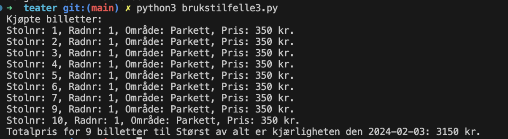
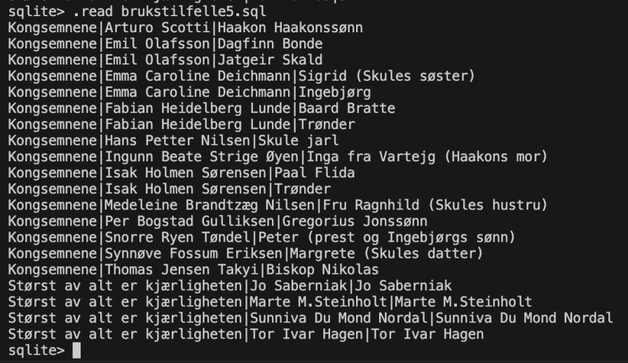
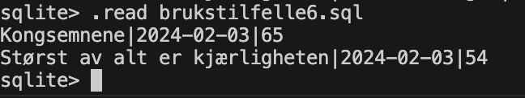
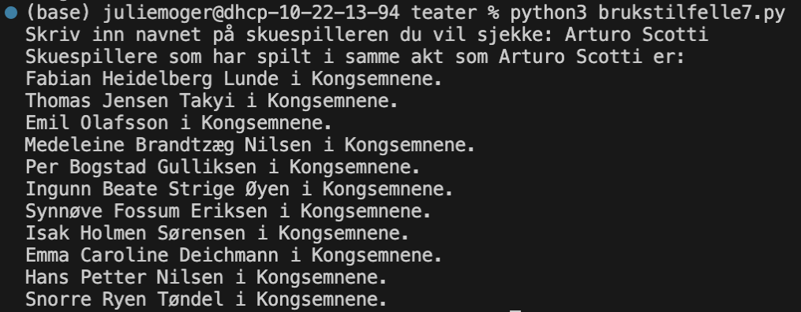

# Prosjekt 2024 - TDT4145 👩🏽‍💻
## Innlevering, del 2: Realisert databasesystem - Trøndelag Teater 🎭🍿
**Gruppemedlemmer 👩‍👩‍👧:** Julie Amundsen Wolff, Julie Egeberg Moger og Hanna Katle Fjon

I dette prosjektet lager vi et system for kjøp av teaterbilletter hos Trøndelag Teater
## Fremgangsmåte for kjøring av brukstilfelle 1 til 7

Brukstilfellene må kjøres i rekkefølge, ettersom senere kommandoer er avhengig av at data ligger i databasen.
Det byttes mellom to terminaler gjennom fremgangsmåten:
* Terminal (1) for kjøring av Python
* Terminal (2) for kjøring i sqlite3

**Brukstilfelle 1**  
*Setter inn saler, stoler, teaterstykker, roller, forestillinger, akter, skuespillere og andre medvirkere.*
1. Åpne terminal (1).
2. Kjør kommando: *python3 teater.py*
    - Denne kommandoen leser teater.sql-filen, og oppretter alle de nødvendige tabellene i teater.db.
3. Åpne en ny terminal (2).
4. Kjør kommando: *sqlite3 teater.db*
    - Dette starter sqlite3 program i terminalen.
5. Kjør kommando: *.read brukstilfelle1.sql*
    - Dette vil sette inn entiteter i de aktuelle tabellene.
6. Gå tilbake til terminal (1)
7. Kjør kommando: *python3 skann-seter.py*
    - Dette leser hovedscenen.txt og gamle-scene.txt og lager en .sql fil for hver sal med innsetting av alle stolene.
8. Gå til terminal (2).
9. Kjør kommando: *.read innsett_stoler_billetter_gamlescene.sql*
10. Kjør kommando:* .read innsett_stoler_billetter_hovedscene.sql*
    - Dette vil sette inn entiteter i stol-tabellen og billett-tabellen i teater.db.
   
**Brukstilfelle ✌🏼**  
*Setter inn hvilke stoler som er solgt.*
1. Åpne terminal (1)
2. Kjør kommando: *python3 brukstilfelle2.py*
    - Dette oppretter innsett_kjøp_gamlescene.sql og innsett_kjøp_hovedscene.sql
3. Åpne terminal (2)
4. Kjør kommando: *.read test_kunde.sql*
5. Kjør kommando: *.read innsett_kjøp_gamlescene.sql*
6. Kjør kommando: *.read innsett_kjøp_hovedscene.sql*
    -  Dette vil sette inn entiteter i billettkjøp-tabellen.

**Brukstilfelle 3**  
*Kjøper 9 voksenbilletter til forestillingen for Størst av alt er
kjærligheten 3. februar, hvor det er 9 ledige billetter og hvor stolene er på samme rad.*
1. Åpne terminal (1)
2. Kjør kommando: *python3 brukstilfelle3.py*
    - Dette vil kjøpe 9 billetter, og skriver til terminalen hvilke billetter som ble kjøpt, og den totale prisen.
    - Dette blir satt inn i billettkjøp-tabellen.
    - Denne kommandoen kan kjøres flere ganger, og det vil bli kjøpt 9 nye billetter helt til det ikke lengre er 9 ledige seter på samme rad.  

Output brukstilfelle 3:    

**Brukstilfelle 4**  
*Tar inn en dato og skriver ut hvilke forestillinger som finnes på denne datoen og lister opp hvor mange billetter som er solgt.*
1. Åpne terminal (1)
2. Kjør kommando: *python3 brukstilfelle4.py*
3. I terminalen står det nå “Skriv inn datoen (åååå-mm-dd): “
4. Skriv inn en dato
    - Eks: 2024-02-03
    - Resultatet du får er forestillingene som er denne datoen, tidspunkt, og antall solgte billetter.
    - Dersom det ikke er noen forestilling denne datoen vil listen være tom.    

Output brukstilfelle 4:    
**Skrev inn 2024-02-03:**  
.png)  
**Skrev inn 2024-02-06 (ingen solgte billetter):**  
.png)

**Brukstilfelle 5**  
*Finner hvilke skuespillere som opptrer i de forskjellige teaterstykkene.*
1. Åpne terminal (2)
2. Kjør kommando: .read brukstilfelle5.sql
    - Resultatet du nå får er en oversikt over navn på hvilke skuespillere som opptrer i de to teaterstykkene, og hvilken rolle de spiller. Noen skuespillere spiller to roller.      

Output brukstilfelle 5:   

**Brukstilfelle 6**  
*Finner hvilke forestillinger som har solgt
best.*
1. Åpne terminal (2)
2. Kjør kommando: .read brukstilfelle6.sql
    - Resultatet du får ut i terminalen er en oversikt over de best solgte forestillingene, sortert på antall plasser i synkende rekkefølge.  
Output brukstilfelle 6:  

**Brukstilfelle 7**  
*Tar in et skuespillernavn og finner
hvilke skuespilllere de har spilt med i samme akt.*
1. Åpne terminal (1)
2. Kjør kommando: *python3 brukstilfelle7.py*
    - Her kjøres pythonfil med tilhørende sql-spørring
    - Her vil teksten “Skriv inn navnet på skuespilleren du ønsker å sjekke:” komme opp.
3.  Skriv inn navnet på den skuespilleren du ønsker å sjekke hvem som har spilt med i samme skuespill og akt.
    - Eks: Arturo Scotti
    - Det er viktig at du skriver inn navnet korrekt for å få opp noen resultater.
4. Resultatet du nå får er navnet på de skuespillerne som har spilt i samme akt og skuespill som den skuespilleren du sjekket for.
Output brukstilfelle 7:  
**Skrev inn Arturo Scotti**

